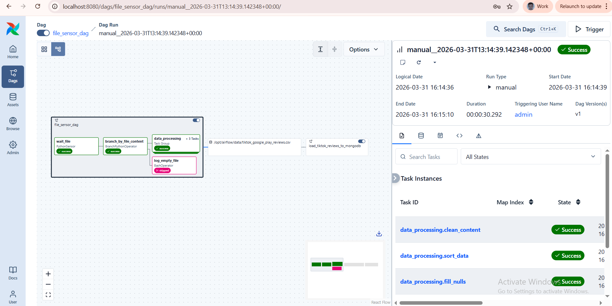

# Airflow — локальная инструкция

Кратко
-- Этот compose поднимает Airflow (web/scheduler), PostgreSQL (metadata) и MongoDB (хранилище результатов).

Требования
- Docker & Docker Compose
- Git (опционально)

Переменные окружения
- Файл `.env` (опционально) поддерживается — проект читает `FOLDER_PATH` и `FILENAME`.
  Пример `.env`:

  FOLDER_PATH=/opt/airflow/data

  FILENAME=tiktok_google_play_reviews.csv

  AIRFLOW_UID=50000

Запуск локально
1. Перейдите в папку `airflow`:

```bash
cd airflow
```

2. Построить и поднять сервисы:

```bash
docker compose up --build
```

3. Airflow UI будет доступен на `http://localhost:8080`.

Куда класть CSV
- Положите `tiktok_google_play_reviews.csv` в папку `airflow/data/` (или в путь, указанный в `FOLDER_PATH`).

Основные DAG'ы
- `file_sensor_dag` — ожидает появления файла и ветвится:
  - если файл пуст — выполняется `log_empty_file` (bash echo);
  - если файл содержит данные — запускается `data_processing` TaskGroup с задачами:
    1) `fill_nulls` — заменяет пустые/NA на `-`;
    2) `sort_data` — сортирует по колонке даты (ищет `at`, `created_at`, `created_date`, `createdDate`);
    3) `clean_content` — очищает поле `content` и помечает датасет (outlet `Asset`).

- `load_tiktok_reviews_to_mongodb` — dataset-aware DAG (запускается при обновлении датасета) и загружает CSV в MongoDB (коллекция `tiktok_reviews` в базе `tiktok_db`).

Скриншот DAG'ов:



MongoDB / Airflow connection
- В `docker-compose.yaml` переменная `AIRFLOW_CONN_MONGO_DEFAULT=mongo://mongodb:27017/tiktok_db`.
- MongoDB доступна на `localhost:27017` (по умолчанию). Данные хранятся в Docker volume `mongodb_data`.

Файл с MongoDB-запросами
- Полный набор запросов находится в файле: [mongo_queries.js](mongo_queries.js)

Проверка и отладка
- Логи Airflow: UI → DAG → Task → Logs.
- Проверка MongoDB из контейнера:

```bash
docker exec -it mongodb mongosh
use tiktok_db
db.tiktok_reviews.count()
```
